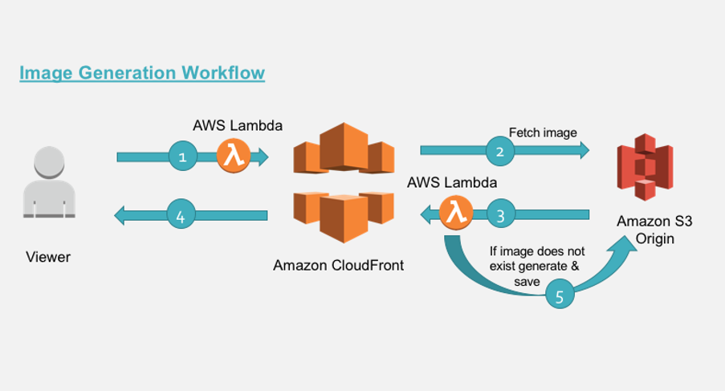

<p align="center">
  
  <h1 align="center">Chitrakaar</h1>
  <p align="center">
    ✨ On-the-Fly Image Wizardry ✨
  </p>
</p>
<br/>
<p align="center">
<a href="https://twitter.com/chh_abracadabra" rel="nofollow"></a>
<a href="https://opensource.org/licenses/MIT" rel="nofollow"></a>
</p>

<br/>

## Introduction 👀

Chitrakaar is a powerful and user-friendly project that enables effortless deployment of on-the-fly image transformation features for your Content Delivery Network (CDN). Built on top of AWS CloudFront and Lambda@Edge, Chitrakaar empowers you to deliver optimized images swiftly and efficiently, giving your users an exceptional visual experience.

## Key Features ✨

1. **Dynamic Image Transformation**: Chitrakaar allows you to perform a wide range of image transformations such as resizing, cropping, fitting, grayscale conversion, adjusting image quality, format conversion, and more. These transformations can be applied on the fly, directly at the edge locations of your CDN.

2. **AWS CloudFront & Lambda@Edge Integration**: Chitrakaar leverages the power of AWS CloudFront and Lambda@Edge, combining their capabilities to deliver lightning-fast image transformations without the need for complex server setup or modifying your existing infrastructure.

3. **TypeScript Lambda Code**: Chitrakaar provides the source code for the Lambda functions written in TypeScript. This allows you to customize and extend the image transformation capabilities to suit your specific needs.

4. **Effortless Deployment with Terraform**: The project includes Terraform configurations, making it easy to deploy the entire stack quickly and conveniently. You can spin up the required resources with minimal effort and have your image transformation pipeline up and running in no time.

## Preview 📺

<p align="center">
  <video src='./docs/demo.mp4' width="80%" />
</p>

## How It Works 🤔

<p align="center">
  
</p>

1. When a user requests an image through the CDN, the request is intercepted by AWS CloudFront.

2. CloudFront checks if the requested image is already cached at the edge location closest to the user.

3. If the image is not cached or the user needs a different transformation, the request is sent to Chitrakaar's Lambda@Edge function.

4. Chitrakaar's Lambda function dynamically transforms the image according to the requested parameters (e.g., width, height, fit, grayscale, quality, format).

5. The transformed image is returned by the Lambda function and cached at the edge location, if caching is enabled.

6. Subsequent requests for the same image with the same parameters are served directly from the cache at the edge, reducing latency and load on the origin server.

7. If the requested image is updated or the cache expires, CloudFront retrieves the updated image from the origin and applies the necessary transformations again.

8. The transformed image is then cached at the edge for future requests, following the same caching mechanism.

9. This process ensures that images are efficiently transformed and delivered to users with minimal delay, optimizing the user experience.

## Deployment 🚀

Follow these steps to deploy the Chitrakaar project, which consists of two parts: `functions` and `terraform`.

### Build Those Functions! 📝

1. Open a command prompt or terminal and navigate to the `functions` folder.

2. Run the following command to install the necessary dependencies:

```bash
npm install
```

3. After the dependencies are installed, execute the following command to transpile and bundle the functions:

```
npm run build
```

4. This will generate a `dist` folder within the `functions` directory containing the compiled TypeScript files needed for deployment.
   Terraform Folder

### Let's sprinkle some Terraform magic! 🪄

1. Open a command prompt or terminal and navigate to the `terraform` folder.

2. Open the `variables.tf` file and locate the `bucket_name` variable.

3. Set the `bucket_name` to a unique value. Note that the bucket name must be unique across AWS, as S3 bucket names are globally unique. Update the value with your desired bucket name.

4. Save the `variables.tf` file.

5. Initialize Terraform by executing the following command:

```bash
terraform init
```

6. After the initialization completes, you can preview the changes that will be applied by running:

```bash
terraform plan
```

7. Review the output of the plan to ensure that it aligns with your expectations.

8. If the plan looks satisfactory, deploy the Chitrakaar solution by running the following command:

```bash
terraform apply
```

9. Terraform will prompt for confirmation to proceed with the deployment. Type `yes` and press Enter to continue.

10. Wait for Terraform to provision the required resources and deploy the Chitrakaar solution. The deployment process may take a few minutes to complete.

11. Once the deployment is finished, Terraform will display a message indicating the successful deployment.

🤩 Congratulations! You have successfully deployed the Chitrakaar project using the provided deployment guide. You can now leverage the image transformation features at the edge provided by Chitrakaar through AWS CloudFront and Lambda@Edge.

## Development 🔧

To facilitate the development process and test the Chitrakaar project locally, follow these steps.

The project includes a `tests` folder, which contains a handy script to mock the Lambda function locally.

#### Prerequisites 📋

Before diving into the development workflow, ensure you have completed the following prerequisites:

1. Install the dependencies for the Lambda function in the `functions` folder. If you haven't done so already, navigate to the `functions` directory in your command prompt or terminal and run `npm install`.

2. Build the dependencies by executing `npm run build` in the `functions` folder. This step generates a `dist` folder with the compiled files necessary for testing.

#### Testing Locally 🧪

1. Access the `tests` folder in your command prompt or terminal.

2. Locate the `test.js` file within the `tests` directory. This file contains a hardcoded event that you can modify to simulate different scenarios and test the Lambda function.

3. Modify the event parameters as desired to test various image transformation scenarios.

4. Invoke the test script with the following command:

```bash
DEV=true node test.js
```

The `DEV=true` environment variable ensures that the image file is written locally, simplifying the verification process.

5. Observe the results and verify the transformations locally. You can check the generated image files to ensure the desired transformations have been applied correctly.

By utilizing the `tests` folder and running the test script locally, you can iterate and fine-tune the image transformation logic and configurations without relying on the AWS CloudFront and Lambda@Edge environment. This streamlined development workflow allows for faster iteration and easier debugging of Chitrakaar's image transformation capabilities.

## API 👽️

Chitrakaar provides a variety of image transformation options to customize the appearance and behavior of your images. The following table outlines the supported transformations, their descriptions, and the available values.

| Key          | Description                                                             | Type / Options                                                                                                                                                           |
| ------------ | ----------------------------------------------------------------------- | ------------------------------------------------------------------------------------------------------------------------------------------------------------------------ |
| `background` | Sets the background color of the image                                  | String (hex or CSS color name)                                                                                                                                           |
| `blur`       | Applies a blur effect to the image                                      | Number (greater than or equal to 0)                                                                                                                                      |
| `fit`        | Controls how the image is fitted within the specified dimensions        | Options: `contain`, `cover`, `fill`, `inside`, `outside`                                                                                                                 |
| `format`     | Specifies the desired output image format                               | Options: `avif`, `dz`, `fits`, `gif`, `heif`, `input`, `jp2`, `jpeg`, `jpg`, `jxl`, `magick`, `openslide`, `pdf`, `png`, `ppm`, `raw`, `svg`, `tif`, `tiff`, `v`, `webp` |
| `gravity`    | Determines the positioning of the image within the specified dimensions | Options: `center`, `centre`, `east`, `north`, `northeast`, `northwest`, `south`, `southeast`, `southwest`, `west`                                                        |
| `grayscale`  | Converts the image to grayscale                                         | Boolean (`true` or `false`)                                                                                                                                              |
| `height`     | Specifies the desired height of the image                               | Number (greater than 0)                                                                                                                                                  |
| `quality`    | Adjusts the image quality                                               | Number (0-100)                                                                                                                                                           |
| `rotate`     | Rotates the image by the specified angle                                | Number (in degrees)                                                                                                                                                      |
| `sharpen`    | Enhances edge sharpness of the image                                    | Number (greater than or equal to 0)                                                                                                                                      |
| `width`      | Specifies the desired width of the image                                | Number (greater than 0)                                                                                                                                                  |

To apply the transformations, simply append the desired parameters to the image URL when making a request to your CloudFront distribution's endpoint. For example:

`<cloudfront-distribution>/image.png?width=300&grayscale=true&format=webp`

This URL will dynamically transform the image by setting its width to 300 pixels, converting it to grayscale, and delivering it in the WebP format.

Here are a few more examples to showcase the image transformations that can be achieved using the Chitrakaar API:

- Resize the image to a width of 500 pixels: `<cloudfront-distribution>/image.jpg?width=500`
- Apply a blur effect with a radius of 10 pixels: `<cloudfront-distribution>/image.jpg?blur=10`
- Fit the image within a square of dimensions 300x300 pixels: `<cloudfront-distribution>/image.jpg?fit=fill&width=300&height=300`
- Convert the image to WebP format: `<cloudfront-distribution>/image.jpg?format=webp`
- Rotate the image by 90 degrees: `<cloudfront-distribution>/image.jpg?rotate=90`
- Adjust the image quality to 80%: `<cloudfront-distribution>/image.jpg?quality=80`

Feel free to explore and experiment with different combinations of transformations to achieve the desired visual effects for your images.

## License 📜

`chitrakaar` is available under the MIT license. See the `LICENSE` file for more info.

## Contributing 🤝

Please read `Contributing.md` for details on our code of conduct, and the process for submitting pull requests to us.

## Shout outs 💥

| <p align="center"><br>[Ishan Chhabra](https://github.com/ishan-chhabra)</p>
| ---------------------------------------------------------------------------------------------------------------------------------- |

## Forking this repo 🚨

Many people have contacted us asking if they can use this code for their own projects. The answer to that question is usually "yes", with attribution. There are some cases, such as using this code for a business or something that is greater than a personal project, that we may be less comfortable saying yes to. If in doubt, please don't hesitate to ask us.

We value keeping this project open source, but as you all know, _**plagiarism is bad**_. We spent a non-negligible amount of effort developing, designing, and trying to perfect this iteration of our project, and we are proud of it! All we ask is to not claim this effort as your own.

So, feel free to fork this repo. If you do, please just give us proper credit by linking back to our website, https://rigi.club. Refer to this handy [Quora post](https://www.quora.com/Is-it-bad-to-copy-other-peoples-code) if you're not sure what to do. Thanks!
